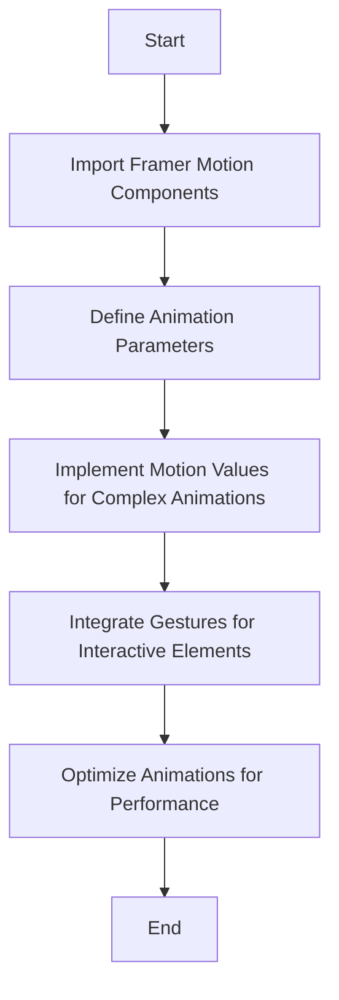

# RFC 2023-12-01 AnimationClient

| Status | Accepted |
|:-------|:---------|

## Background

- [See Framer Motion for animation decision](002-Framer-Motion.md)

## Design Proposal

The integration of AnimationClient with Framer Motion aims to enhance our
application's user interface with fluid and responsive animations. Framer Motion
is a React library that simplifies the process of creating animations and allows
for more dynamic and engaging UIs. The implementation strategy is as follows:

1. **Importing Framer Motion**: Start by importing Framer Motion components such
   as `motion`. This library provides a powerful yet straightforward way to
   implement animations in React applications.

2. **Defining Animation Parameters**: Utilize Framer Motion's `animate`,
   `initial`, and `exit` properties to define how elements should animate in,
   stay, and animate out.

3. **Leveraging Motion Values**: Use Framer Motion's motion values to create
   more complex animations and transitions. Motion values can be used to
   interpolate values, track the state of animations, or react to user input.

4. **Integrating with Gestures**: Implement gesture animations, such as drag or
   hover effects, using Framer Motion's gesture handlers. This allows for
   interactive and intuitive UI elements.

5. **Optimizing for Performance**: Utilize Framer Motion's features like
   `AnimatePresence` for optimized mounting and unmounting animations, ensuring
   minimal performance impact.

**Example in Practice**: An interactive card component that scales up on hover
and has a smooth fade-in effect when it enters the viewport. This card can be
implemented using the `motion.div` component with appropriate `hover` and
`initial` properties.

**The Role of Framer Motion in Development**: Framer Motion simplifies the
process of adding animations to a React application, making it easier for
developers to create engaging and interactive UIs without extensive animation
knowledge.

## Detailed Design Proposal

**Overall Process Flowchart**



Here's a breakdown of the flowchart:

- **Start**: The beginning of the AnimationClient implementation process.
- **Import Framer Motion Components**: Importing necessary components from
  Framer Motion.
- **Define Animation Parameters**: Setting up initial, animate, and exit
  properties for animations.
- **Implement Motion Values**: Utilizing motion values for detailed animation
  control.
- **Integrate Gestures**: Adding interactive gesture-based animations.
- **Optimize Animations**: Ensuring animations are performant and do not hinder
  the user experience.
- **End**: Completion of the AnimationClient implementation process.

## User Stories

For detailed user stories,
[see Framer Motion User Stories](https://kurocado.youtrack.cloud/issue/KDS-21/Implementation-of-AnimationClient-Using-Framer-Motion).
These stories include scenarios demonstrating the application of animations to
improve user interactions and UI responsiveness.

## Alternatives Considered

In the decision to integrate AnimationClient with Framer Motion for our React
applications, we thoroughly evaluated several alternative animation libraries
and approaches. The goal was to find a solution that provides an optimal balance
of ease of use, flexibility, performance, and integration with our existing
React ecosystem. Below is a comprehensive analysis of the alternatives
considered and the reasons for preferring Framer Motion.

1. **CSS Animations**:

   - **Pros**:
      - Native to the web and does not require additional libraries.
      - Widely supported across all modern browsers.
      - Simple animations can be implemented quickly.
   - **Cons**:
      - Limited in complexity and control compared to JavaScript-based solutions.
      - Requires additional effort to synchronize with Reacts lifecycle and
        state.
   - **Analysis**: While CSS animations are efficient for simpler tasks, they
     lack the dynamic interaction capabilities and integration ease that Framer
     Motion offers with React components.

2. **React Spring**:

   - **Pros**:
      - Provides a more natural physics-based approach to animations.
      - Supports a wide range of animations and transitions.
      - Good integration with React's component model.
   - **Cons**:
      - Steeper learning curve due to its physics-based approach.
      - Configuration can be complex for elaborate animations.
   - **Analysis**: React Spring is a strong contender with its physics-based
     system, offering realistic animations. However, Framer Motion's simpler API
     and ease of use for a broad range of animations make it more suitable for
     our diverse project needs.

3. **GreenSock Animation Platform (GSAP)**:

   - **Pros**:
      - Extremely powerful and versatile, suitable for complex animations.
      - High performance and browser compatibility.
      - Large community and extensive documentation.
   - **Cons**:
      - Overhead of learning and integrating another external library.
      - Some advanced features are behind a paid license.
   - **Analysis**: GSAP is undoubtedly powerful for complex animations, but it
     introduces additional complexity and potential costs. Framer Motion
     provides sufficient capabilities for our needs, with a more straightforward
     integration path for React.

4. **React Motion**:

   - **Pros**:
      - Physics-based animation library, offering realistic motion.
      - Integrates well with React's component lifecycle.
   - **Cons**:
      - Less intuitive API compared to other libraries.
      - Somewhat limited in features and community support compared to Framer
        Motion.
   - **Analysis**: React Motion is a decent option but falls short in ease of
     use and the breadth of features that Framer Motion excels in.

5. **Velocity.js**:
   - **Pros**:
      - High performance and feature-rich.
      - Works outside the React ecosystem as well.
   - **Cons**:
      - Requires manual handling to integrate with React's state and component
        lifecycle.
      - Not as React-centric as Framer Motion.
   - **Analysis**: Velocity.js is more suited for general web animations outside
     the React framework. Framer Motion's React-focused approach provides a more
     streamlined and efficient workflow for our React applications.

## Performance Implications

1. **Speed**:

   - Framer Motion is designed to be lightweight and efficient, aiming to
     minimize any negative impacts on rendering speed.
   - The use of hardware-accelerated CSS properties for animations should ensure
     smooth performance across various devices.

2. **Memory Usage**:

   - As a JavaScript-based animation library, Framer Motion could potentially
     increase the memory footprint of an application, especially when managing
     numerous or complex animations.
   - Proper usage and optimization techniques, such as cleaning up unused motion
     components, are essential to prevent memory leaks.

3. **Efficiency**:
   - Framer Motion provides tools like `AnimatePresence` for efficient component
     mounting and unmounting, which helps in optimizing performance for page
     transitions and animated lists.
   - The library's approach to managing animations in a declarative matter
     within React components should align well with React's virtual DOM,
     minimizing unnecessary DOM manipulations.

#### Performance Confirmation and Testing Plans

1. **Benchmarking**:

   - Implement benchmarks comparing the performance of applications before and
     after integrating Framer Motion. Metrics such as Time to Interactive (TTI)
     and First Input Delay (FID) will be valuable.
   - Utilize browser performance tools like Chrome DevTools to monitor frame
     rates and paint times during animations.

2. **Memory Profiling**:

   - Conduct memory profiling sessions using browser development tools to
     identify any potential memory leaks or excessive memory consumption related
     to animations.
   - Regularly monitor the JavaScript heap size when animations are running.

3. **Real-world Testing**:

   - Perform real-world user testing on various devices, especially on lower-end
     devices, to ensure animations remain smooth and do not degrade the user
     experience.
   - Gather user feedback regarding the perceived performance and responsiveness
     of animations.

4. **Continuous Performance Monitoring**:
   - Integrate performance monitoring tools within our development pipeline to
     continually track and address any performance issues.
   - Establish alerts for significant performance regressions as new features
     and animations are added to the application.

### Metrics and Benchmarks

- **Frame Rate**: Aim for a consistent 60 frames per second in animations for
  smooth motion.
- **Load Time Metrics**: Monitor metrics such as TTI and FID to ensure they
  remain within acceptable ranges.
- **Memory Usage**: Keep track of memory allocation and garbage collection
  events during animation-heavy interactions.

## Dependencies

#### Framer Motion Library

1. **Impact on the System**:

   - **Bundle Size**: Adding Framer Motion will increase the overall bundle size
     of our applications. While Framer Motion is relatively lightweight, careful
     consideration is needed to ensure that only necessary features are
     imported.
   - **React Compatibility**: Framer Motion is specifically designed for React
     applications, so its integration should be seamless. However, it's
     important to ensure that it remains compatible with the version of React
     used in our projects.
   - **Development Workflow**: Incorporating Framer Motion will require updates
     to our development workflow, including additional training for developers
     and potentially new standards for animation implementation in our projects.

2. **Dependency Management**:
   - **Version Management**: We will manage the version of Framer Motion using
     our package manager (e.g., npm or Yarn) to ensure we're using a stable and
     compatible version with our React setup.
   - **Regular Updates**: Scheduled checks for updates to Framer Motion will be
     part of our routine maintenance to ensure we benefit from the latest
     features, performance improvements, and security patches.
   - **Performance Monitoring**: Continuous performance monitoring will be
     implemented to detect any impacts caused by updates or changes in the
     Framer Motion library.

#### Other Considerations

1. **Peer Dependencies**:
   - Framer Motion may have peer dependencies, such as specific versions of
     React or other libraries. These will be identified and managed through our
     package management system to ensure compatibility.

## Engineering Impact

The introduction of Framer Motion as a primary tool for animations in our React
applications will have notable impacts on various aspects of the engineering
process, including development, testing, and maintenance.

#### Development Impact

1. **Learning and Adaptation**:

   - Engineers will need to familiarize themselves with the Framer Motion
     library. This includes understanding its API and how it integrates with
     React components.
   - Training sessions or workshops may be necessary to bring the development
     team up to speed.

2. **Workflow Integration**:
   - Development workflows will be updated to include animation design and
     implementation as integral parts of the UI/UX development process.
   - Collaboration between UI/UX designers and developers will be crucial to
     ensure animations align with design intentions and enhance user experience.

#### Maintenance Impact

1. **Ongoing Maintenance**:

   - Framer Motion updates and their impact on the application will be regularly
     monitored.
   - The team will stay informed about any new features or changes in Framer
     Motion that could enhance or affect our animation implementations.

2. **Code Ownership and Documentation**:
   - Clear ownership of the animation-related code will be established, with
     specific team members responsible for maintenance.
   - Comprehensive documentation will be maintained for our animation
     implementations, including examples, guidelines, and common troubleshooting
     scenarios.

## Integration within the Existing System

1. **Gradual Integration**:
   - The introduction of Framer Motion will be gradual, starting with
     non-critical components to assess its impact and refine our approach.
   - Feedback will be gathered from these initial implementations to guide
     further integration.

- This support might include code review assistance, troubleshooting, and
  mentoring.

### Testing

1. **Unit and Integration Testing**:

   - New testing strategies will be developed to include animation
     functionalities. This might involve testing the presence, performance, and
     triggering of animations under various conditions.
   - Integration tests will ensure that animations do not interfere with the
     functionality of other components or the overall application.

2. **Performance Testing**:
   - Performance tests will be necessary to ensure that animations do not
     negatively impact the application's speed and responsiveness.
   - Automated performance testing tools will be integrated into our CI/CD
     pipeline to monitor these aspects.

## Maintenance

Regular updates and maintenance of the Framer Motion library will be crucial,
along with documentation of animation patterns and best practices used in our
projects.

## Tutorials and Examples

### Basic Animation Example

A basic example showcasing a button with a hover effect using Framer Motion:

```javascript
import {motion} from 'framer-motion';

const AnimatedButton = () => {
	return (
		<motion.button whileHover={{scale: 1.1}} whileTap={{scale: 0.9}}>
			Click Me
		</motion.button>
	);
};
```

This example demonstrates the simplicity and power of Framer Motion in creating
interactive UI elements.
