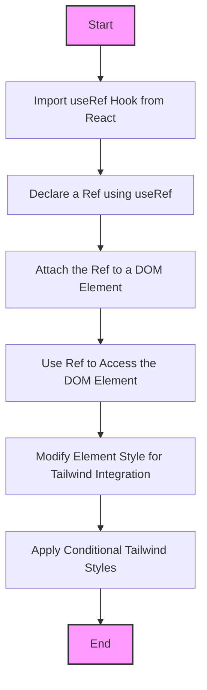

# RFC 2023-12-01 CSSClient

| Status | Proposed |
| :----- | :------- |

## Background

- [See Tailwind CSS for Styling decision](001-Tailwind-CSS.md)

## Design Proposal

In the context of integrating CSSClient into the design system, it is important
to understand how React's `useRef` hook can complement this process by providing
a method for dynamic style changes without causing component re-renders. Here's
a breakdown of its implementation:

1. **Importing useRef Hook**: Begin by importing `useRef` from React. This hook
   is instrumental in accessing a specific DOM element for styling purposes,
   which can be especially useful in a design system where precise control over
   elements is needed.

2. **Declaring a Ref**: Establish a ref by declaring it using `useRef`, and then
   link it to the required DOM element with the `ref` attribute. This step is
   crucial for targeting elements for styling, particularly when using Tailwind
   classes dynamically.

3. **Understanding useRef's Output**: `useRef` returns an object with a
   `current` property. React assigns this property a reference to the chosen DOM
   element. The element can then be manipulated via an event handler, which can
   be a key technique in applying conditional Tailwind styles.

4. **Accessing the Element**: Utilize the `current` property of the ref to
   access the specific element. This approach is invaluable in a design system
   where components might need to be styled differently based on certain
   conditions or states.

5. **Modifying Element Style**: Modify the element's style using
   `ref.current.style`. In the context of a Tailwind-based design system, this
   could involve dynamically applying Tailwind classes based on user interaction
   or other criteria.

**Example in Practice**: Consider a `div` element with text within your design
system. To dynamically change its style, such as toggling Tailwind's dark mode
classes, use `useRef` to target and modify the div's styling. For instance, a
button could be used to switch the background color of the div to black,
demonstrating a practical application of `useRef` with Tailwind in a design
system.

**The Role of useRef in Development**: Beyond style changes, `useRef` serves as
a direct link to DOM manipulation. By assigning a `ref` attribute to a DOM
element, it becomes directly accessible. This is particularly useful in a
Tailwind-based design system for applying or changing Tailwind classes
dynamically, enabling a more interactive and responsive design.

**Preference for `useRef` with Tailwind CSS**:

- The combination of `useRef` with Tailwind provides a balance of direct DOM
  manipulation (for unique cases where dynamic styling is necessary) and
  utility-first styling (for most other styling needs).
- This approach allows for efficient styling changes without re-renders,
  leveraging Tailwind's utility classes for most styling while still having the
  flexibility to manipulate styles directly when needed.
- It avoids the overhead of larger libraries or frameworks and stays close to
  React's and Tailwind's core principles, making it an efficient choice for many
  use cases.

## Detailed Design Proposal

**Proposed abstraction**

```typescript
interface ICSSClient {
	classNames: Array<string> | undefined;
	prependClassNames(classNames?: Array<string>): Array<string>;
	appendClassNames(classNames?: Array<string>): Array<string>;
	resetClassNames(): Array<never>;
	updateTheme(classNames?: Array<string>): Array<string>;
}

abstract class CSSClient implements ICSSClient {
	public abstract readonly classNames: Array<string> | undefined;
	public abstract readonly appendClassNames: (
		classNames?: Array<string>,
	) => Array<string>;
	public abstract readonly prependClassNames: (
		classNames?: Array<string>,
	) => Array<string>;
	public abstract readonly resetClassNames: () => Array<never>;
	public abstract readonly updateTheme: (
		classNames?: Array<string>,
	) => Array<string>;
}
```

**Overall flowchart**



Here's a breakdown of the flowchart:

- **Start**: The beginning of the useRef implementation process.
- **Import useRef Hook from React**: Importing the `useRef` hook from React.
- **Declare a Ref using useRef**: Creating a ref variable using the `useRef`
  hook.
- **Attach the Ref to a DOM Element**: Linking the ref to the desired DOM
  element.
- **Use Ref to Access the DOM Element**: Accessing the DOM element via the ref
  for styling purposes.
- **Modify Element Style for Tailwind Integration**: Altering the style of the
  element, which can include adding or removing Tailwind CSS classes.
- **Apply Conditional Tailwind Styles**: Dynamically applying Tailwind styles
  based on conditions or states.
- **End**: Completion of the useRef implementation process.

Each step is linked to additional resources for more in-depth understanding,
where applicable. This flowchart serves as a concise visual guide for senior
software engineers to grasp the useRef implementation process in the context of
a Tailwind-based design system.

## User Stories

For detailed user stories,
[see Implementation of CSSClient Using Tailwind CSS](https://kurocado.youtrack.cloud/issue/KDS-6/Implementation-of-CSSClient-Using-Tailwind-CSS).
Key stories include scenarios demonstrating the dynamic application of Tailwind
classes in response to user interactions, highlighting the system's adaptability
and responsiveness.

## Alternatives Considered

To provide a comprehensive analysis, let's consider the context of your
proposal. Since we discussed using the `useRef` hook in React for dynamic
styling, particularly in conjunction with Tailwind CSS in a design system, I
will assume the alternatives are related to this context. Here are some
alternative approaches:

1. **CSS-in-JS Libraries (e.g., Styled Components, Emotion)**:

   - **Pros**:
      - Enhances component encapsulation by co-locating styles with components.
      - Offers powerful theming capabilities and dynamic styling based on props.
      - Eliminates class name bugs and eases refactoring.
   - **Cons**:
      - Adds an extra layer of abstraction and a slight learning curve.
      - Potentially increases bundle size.
      - May not integrate as seamlessly with utility-first CSS frameworks like
        Tailwind.
   - **Analysis**: While CSS-in-JS offers more dynamic styling capabilities, it
     might not be as straightforward when used with Tailwind, which already
     provides utility classes for most styling needs.

2. **Inline Styling or Conditional Class Names**:

   - **Pros**:
      - Straightforward implementation with no additional dependencies.
      - Good for quick, simple style changes.
   - **Cons**:
      - Can become unwieldy for complex styling.
      - Lacks the scalability and maintainability offered by CSS frameworks like
        Tailwind.
   - **Analysis**: Inline styling is simple but lacks the robustness of a
     utility-first approach like Tailwind combined with `useRef`.

3. **Higher-Order Components (HOCs) or Render Props**:

   - **Pros**:
      - Offers reusable logic across components.
      - Can encapsulate and abstract complex logic away from components.
   - **Cons**:
      - Can make the component tree harder to understand.
      - Adds complexity, especially for newcomers.
   - **Analysis**: HOCs or render props provide reusable solutions but might be
     unnecessarily complex for tasks that `useRef` can handle more directly.

4. **CSS Variables with JavaScript**:
   - **Pros**:
      - High flexibility in manipulating styles programmatically.
      - Good browser support and native to the web platform.
   - **Cons**:
      - Can be less intuitive than using a dedicated framework or library.
      - Requires manual management of dependencies between styles.
   - **Analysis**: CSS variables offer a native way to handle dynamic styles but
     lack the utility and pre-built patterns of Tailwind CSS.

## Performance Implications

When evaluating the performance implications of using the `useRef` hook in
React, especially in conjunction with Tailwind CSS for styling, several factors
need to be considered. These include speed, memory usage, and overall
efficiency. Here's a detailed look at these aspects:

1. **Speed and Rendering Efficiency**:

   - **Direct DOM Manipulation with useRef**: Unlike state updates, `useRef`
     does not trigger component re-renders. This means that using `useRef` for
     styling changes can lead to faster UI updates, as it bypasses the usual
     React update lifecycle.
   - **Tailwind CSS Efficiency**: Tailwind, being a utility-first CSS framework,
     contributes to faster rendering times due to its use of pre-defined
     classes. This minimizes the time spent calculating styles.

2. **Memory Usage**:
   - **Minimal Overhead with useRef**: The `useRef` hook is a lightweight
     approach to access DOM elements. It does not contribute significantly to
     memory usage as it simply holds a reference to a DOM element.
   - **Tailwind CSS Compilation**: The compiled size of Tailwind CSS can be
     large if not purged correctly. However, with proper configuration and
     tree-shaking, only the used classes are included in the final build,
     minimizing the memory footprint.

## Dependencies

The proposal to use the `useRef` hook in conjunction with Tailwind CSS in a
React application introduces a set of dependencies and considerations. Here's a
detailed analysis:

1. **Primary Dependencies**:

   - **React**: As the `useRef` hook is a part of React, your project must be
     using a version of React that supports hooks (React 16.8 or later).
   - **Tailwind CSS**: This is a utility-first CSS framework that will be used
     for styling components.

2. **Dependency Management**:

   - **Version Compatibility**: Ensure that the versions of React and Tailwind
     CSS are compatible with each other and with the rest of your project's
     ecosystem.
   - **Package Management**: Use a package manager like npm or Yarn to manage
     these dependencies. This includes keeping track of the versions and
     updating them as necessary.

3. **Impact on the System**:

   - **Build Process**: Tailwind CSS requires a build process to compile the
     utility classes. This might involve setting up PostCSS and configuring your
     build tools (like Webpack or Parcel) to handle Tailwind's processing.
   - **Bundle Size**: Monitor the impact of Tailwind on the bundle size. Though
     Tailwind can be tree-shaken to remove unused styles, it's important to
     configure this correctly to avoid bloating the bundle.

4. **Performance Considerations**:

   - **Tailwind CSS Efficiency**: While Tailwind can improve development speed,
     its impact on runtime performance should be monitored, especially if many
     utility classes are used.
   - **React's Overhead**: The use of React's `useRef` is minimal in terms of
     performance overhead, but it's essential to use it judiciously to maintain
     readability and maintainability of the code.

5. **Dependency Risk Management**:
   - **Regular Updates and Audits**: Regularly update the dependencies to their
     latest stable versions to benefit from improvements and security patches.
     Conduct periodic audits using tools like npm audit.
   - **Fallback Strategies**: Have fallback strategies in case of breaking
     changes in dependencies. This includes maintaining proper version control
     and having a robust testing suite to detect issues early.

## Engineering Impact

The integration of the `useRef` hook with Tailwind CSS into a React application
will have several impacts on the engineering process, encompassing development,
testing, and maintenance. Let's break down these impacts:

1. **Development Impact**:

   - **Learning Curve**: Engineers may need to familiarize themselves with
     Tailwind CSS and the nuances of using `useRef` in React. This could
     initially slow down development as the team adapts.
   - **Increased Development Speed**: Once accustomed, Tailwind's utility-first
     approach can significantly speed up the development process by reducing the
     need for writing custom CSS.
   - **Code Consistency and Readability**: The consistent use of Tailwind
     classes and the controlled application of `useRef` can improve code
     readability and maintainability, provided the team adheres to established
     standards.

2. **Testing Impact**:

   - **Unit Testing**: The use of `useRef` and Tailwind should not significantly
     impact the unit testing process for React components. However, tests may
     need to account for direct DOM manipulations if they affect component
     behavior.
   - **UI and Snapshot Testing**: Visual regressions and UI behaviors may need
     additional attention, especially if dynamic styling is heavily used.
     Snapshot testing tools can be useful here.
   - **Integration Testing**: Ensure that the integration of Tailwind CSS and
     `useRef` does not introduce unforeseen side effects, particularly in
     components where state and DOM manipulations are complex.

3. **Maintenance Impact**:
   - **Codebase Scalability**: Tailwind CSS can aid in maintaining a scalable
     and consistent codebase, but it requires diligent management of styles and
     adherence to best practices.
   - **Refactoring and Upgrades**: Future updates to React or Tailwind CSS may
     require refactoring. Regularly updating and testing these dependencies is
     crucial for maintenance.
   - **Documentation**: Proper documentation of styling conventions and `useRef`
     usage patterns is vital for long-term maintenance and onboarding new
     developers.

## Tutorials and Examples

Understood. Let's streamline the example to fit into a more concise technical
documentation format, focusing on demonstrating the usage of `useRef` with
Tailwind CSS in React while adhering to SOLID principles.

### Using `useRef` with Tailwind CSS in React (SOLID Principles)

#### Custom Hook: `useToggleStyle`

A custom hook `useToggleStyle` is created to encapsulate the logic for toggling
styles, adhering to the Single Responsibility Principle.

```javascript
import {useRef} from 'react';

const useToggleStyle = (initialClasses, toggleClasses) => {
	const elementRef = useRef(null);

	const toggleStyle = () => {
		toggleClasses.forEach((cls) => {
			elementRef.current.classList.toggle(cls);
		});
	};

	return {elementRef, toggleStyle};
};

export default useToggleStyle;
```

#### Component: `DynamicStyledComponent`

The component uses `useToggleStyle` for styling, demonstrating the Open/Closed
Principle by allowing style extension without modification.

```typescript
import React from 'react';
import useToggleStyle from './useToggleStyle';

const DynamicStyledComponent = () => {
    const { elementRef, toggleStyle } = useToggleStyle(['bg-blue-500'], ['bg-blue-500', 'bg-red-500']);

    return (
        <div>
            <div ref={elementRef} className="text-white p-4 my-2">
                This is a dynamic styled div.
            </div>
            <button onClick={toggleStyle} className="bg-gray-300 p-2 rounded">
                Toggle Color
            </button>
        </div>
    );
};

export default DynamicStyledComponent;
```

#### Integration

The `DynamicStyledComponent` can be integrated into your React application,
demonstrating the practical use of the `useRef` hook with Tailwind CSS. The
component and hook are designed to be flexible and maintainable, following SOLID
principles.

#### Maintenance

The `useToggleStyle` hook abstracts style manipulation logic, making it reusable
and maintainable. The `DynamicStyledComponent` remains open for extension (e.g.,
adding new styles or functionalities) while keeping changes localized and
manageable.

This approach provides a scalable and efficient way to manage dynamic styling in
React applications, ensuring code quality and ease of maintenance.
