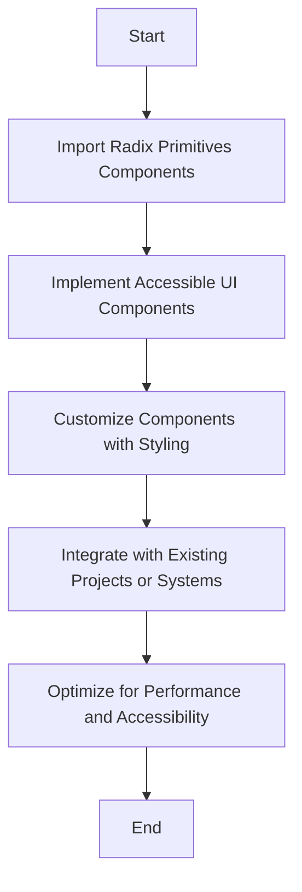

# RFC 2023-12-01 UIPrimitivesClient

| Status | Proposed |
| :----- | :------- |

## Background

- [See Radix Primitives for UI decision](Radix-for-unstyled-UI-primitives.md)

## Design Proposal

The integration of UIPrimitivesClient with Radix Primitives is aimed at
enhancing our application's UI componentry. Radix Primitives is a low-level UI
component library that focuses on accessibility, customization, and developer
experience. The implementation strategy includes:

1. **Importing Radix Primitives**: Begin by importing necessary components from
   Radix Primitives. This library offers a comprehensive set of base components
   for building a design system.

2. **Understanding Radix's Architecture**: Familiarize with Radix's open
   component architecture that allows for granular access and customization.

3. **Implementing Accessibility**: Leverage Radix's adherence to WAI-ARIA design
   patterns to ensure that our components meet high accessibility standards.

4. **Customization of Components**: Utilize the unstyled nature of Radix
   components to apply our own styling, whether it be with CSS, Tailwind, or
   CSS-in-JS solutions.

5. **Integrating with Existing Systems**: Assess how Radix components can be
   incrementally adopted into our existing projects or used as the foundation
   for new ones.

**Example in Practice**: Implementing a customizable and accessible dropdown
menu using Radix Primitives, demonstrating the integration of Radix components
with our own styling system.

**The Role of Radix Primitives in Development**: Radix Primitives will serve as
a foundational layer for building a robust and accessible design system,
streamlining the development process and ensuring consistency across projects.

## Detailed Design Proposal

**Proposed abstraction**

```typescript
interface IUIPrimitivesClient {
	// Example methods for UIPrimitivesClient abstraction
	createDropdownMenu(options: DropdownMenuOptions): DropdownMenu;
	createDialog(options: DialogOptions): Dialog;
	// Additional methods for other UI components
}

class UIPrimitivesClient implements IUIPrimitivesClient {
	// Implementation details using Radix Primitives
}
```

**Overall Flowchart**



Here's a breakdown of the flowchart:

- **Start**: Initiation of the UIPrimitivesClient implementation process.
- **Import Radix Primitives Components**: Importing the necessary components
  from Radix Primitives.
- **Implement Accessible UI Components**: Utilizing Radix's components to create
  accessible UI elements.
- **Customize Components with Styling**: Applying custom styles to the unstyled
  Radix components.
- **Integrate with Existing Projects or Systems**: Assessing and planning the
  integration of Radix components into our current and future projects.
- **Optimize for Performance and Accessibility**: Ensuring that the integration
  of Radix components enhances both performance and accessibility of our
  applications.
- **End**: Completion of the UIPrimitivesClient implementation process.

## User Stories

For detailed user stories,
[see Implementation of UIPrimitivesClient Using Radix UI](https://kurocado.youtrack.cloud/issue/KDS-16/Implementation-of-UIPrimitivesClient-Using-Radix-UI).
These stories will include scenarios that demonstrate the application of Radix
components in building accessible and customizable UIs.

## Alternatives Considered

In considering Radix Primitives for our UIPrimitivesClient, we evaluated several
alternatives, focusing on their ability to provide accessible, customizable, and
developer-friendly UI components. Below is an analysis of these alternatives:

**Native HTML Elements**:
- **Pros**: Widely supported and require no additional dependencies.
- **Cons**: Limited in functionality and require significant effort to make
  accessible and customizable.
- **Analysis**: While native HTML elements are the foundation of web
  development, they often fall short in providing the advanced functionality and
  customization needed for modern web applications.

**Other UI Libraries (e.g., Material-UI, Ant Design)**:
- **Pros**: Offer a wide range of pre-styled components with various
  functionalities.
- **Cons**: Often come with a predefined design language that may not align with
  our branding and can be cumbersome to override.
- **Analysis**: These libraries provide robust solutions but lack the
  flexibility and unstyled nature of Radix that allows for complete
  customization.

**Building Custom Components from Scratch**:

- **Pros**: Full control over functionality and style.
- **Cons**: Time-consuming and resource-intensive; challenging to ensure
  accessibility and consistency across projects.
- **Analysis**: Creating custom components offers maximum control but at the
  cost of increased development time and potential inconsistencies.

## Performance Implications

1. **Efficiency**: Radix Primitives are designed to be lightweight and
   efficient, having minimal impact on performance.
2. **Accessibility Performance**: Given Radix's focus on accessibility, we will
   ensure that our implementations do not negatively impact performance for
   assistive technologies.
3. **Customization Impact**: While customization provides flexibility, we'll
   monitor its impact on performance, ensuring that our styling solutions are
   optimized.

## Dependencies

**Radix Primitives Library**

1. **Impact on the System**:

- Bundle size considerations and ensuring compatibility with our React version.
- Integration into our development workflow, including updates to our component
  building and styling processes.

2. **Dependency Management**:

- Regular updates and compatibility checks with Radix Primitives.
- Monitoring and managing any peer dependencies that Radix might have.

## Engineering Impact

#### Development Impact

- **Familiarization and Training**: Introducing Radix Primitives will require
  developers to understand its API and component model.
- **Styling Integration**: Developing a consistent approach to styling Radix
  components in line with our design system.


## Integration within the Existing System

- **Gradual Adoption**: Starting with less critical components and gradually
  expanding the use of Radix as we assess its fit and impact.
- **Compatibility Checks**: Ensuring Radix components work seamlessly with
  existing parts of our system, including state management and data flow.

## Tutorials and Examples

### Basic Component Example

Demonstrating the implementation of an accessible dropdown menu using Radix
Primitives:

```typescript
import * as DropdownMenuPrimitive from '@radix-ui/react-dropdown-menu';

const DropdownMenu = () => {
  return (
    <DropdownMenuPrimitive.Root>
      <DropdownMenuPrimitive.Trigger>Options</DropdownMenuPrimitive.Trigger>
      <DropdownMenuPrimitive.Content>
        <DropdownMenuPrimitive.Item onSelect={() => console.log('Item 1')}>
          Item 1
        </DropdownMenuPrimitive.Item>
        <DropdownMenuPrimitive.Item onSelect={() => console.log('Item 2')}>
          Item 2
        </DropdownMenuPrimitive.Item>
      </Dropdown>
  )
}
```
