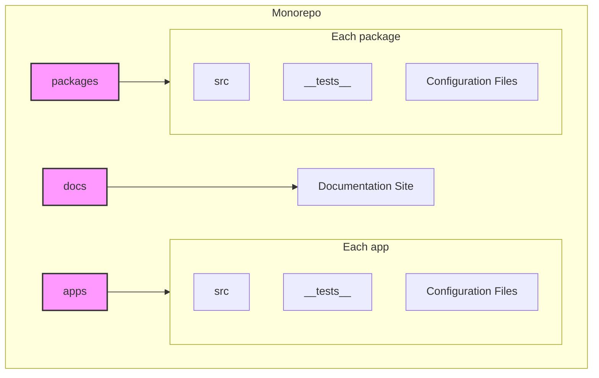
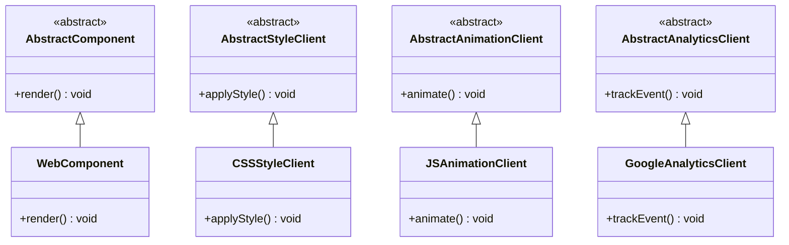
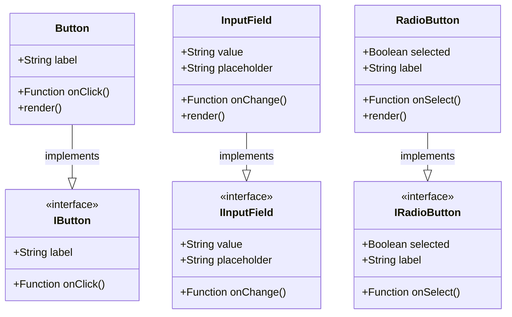
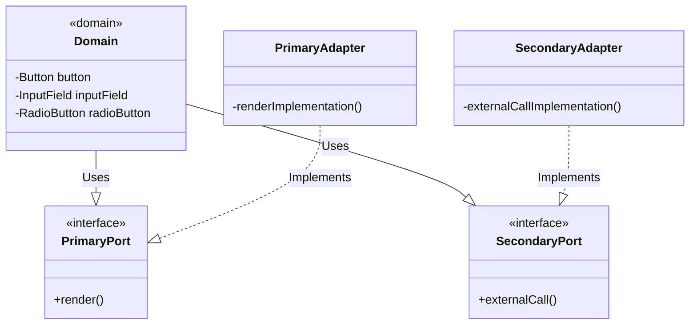

# Kurocado Design System RFC

| Status        | (Proposed)                                            |
|:--------------|:------------------------------------------------------|
| **Author(s)** | [Kurocado Studio](https://github.com/Kurocado-Studio) |

## Objective

To create a comprehensive design system with UI components, styling guidelines, accessibility standards, and testing frameworks for Kurocado Studio, serving as the base for all its products.

## Motivation

This document describes all the specifications and product requirements for the Kurocado Design System, including functionality and descriptions of the users interacting with the system and the technology behind it.

## User Benefit

* Consistency and Cohesion
* Enhanced User Experience
* Brand Identity Reinforcement
* Quality and Reliability

## Design Proposal

## Monorepo Setup
Our project will adopt a [monorepo setup](002-TurboRepo.md) that consolidates our diverse range of applications and shared resources into a single repository. This centralized structure simplifies dependency management, streamlines workflows, and enhances collaboration across teams. Within this monorepo, we will have distinct high-level directories:


- **apps**: This directory will house individual applications that comprise the broader ecosystem. Each app will be a standalone entity but will share common design elements and utilities from the monorepo.
  packages: Shared libraries and reusable components will reside here. These are the building blocks of our applications and will be consumed by multiple apps to ensure DRY (Don't Repeat Yourself) principles.
-
- **docs**: A dedicated space for the documentation site, which details the usage of the design system, components, and any additional developer resources.
  Each app and package will maintain a uniform internal structure, promoting organizational consistency and easing the cognitive load for developers navigating different parts of the monorepo. The structure includes:
-
- **src**: The source directory where the actual React components and other JavaScript modules live.
-
- **__tests__**: A dedicated directory for automated tests, enabling a test-driven development approach.
  Configuration files: Essential configurations for ESLint, TypeScript, and other tools will be standardized across the repository.

## System Architecture Using Abstract Classes
This outlines an architecture for a design system that leverages abstract classes to ensure flexibility, maintainability, and scalability. The architecture focuses on four core components (but will have more as requirements change):

1. Rendering of UI components.
2. Handling of styling.
3. Management of animations.
4. Analytics tracking.

#### Benefits of Using Abstract Classes

- **Encapsulation:** Abstract classes allow the encapsulation of common logic and interfaces, which can be shared across multiple implementations.
- **Flexibility:** They provide a framework for ensuring consistency while allowing flexibility in the implementation of details.
- **Maintenance:** Centralizing common behavior in abstract classes makes the system more maintainable and allows for changes to be made in a single place.
- **Extension:** They facilitate easy extension of the system with new functionalities without significant alterations to the existing structure.

## System Design
The design consists of abstract classes for each of the core components and their concrete implementations, [**see also Domain-Driven-Design.md**](Domain-Driven-Design.md).



### Hexagonal Architecture Overview:
- **Domain:** This is the core logic of your application. In your case, it's the behavior of UI components (Button, InputField, RadioButton).
- **Ports:** These are interfaces that define how the application communicates with the outside world. They can be primary (driven by the application, e.g., UI rendering) or secondary (driven by external factors, e.g., data storage).
- **Adapters:** These are implementations that connect the outside world to your application. For instance, an adapter might render a Button as HTML for a web interface or as a widget for a desktop application.

### Applying Hexagonal Architecture to the Design System:
1. **Domain Layer:**
  - Contains the core logic of UI components.
  - Examples: Button, InputField, RadioButton classes.

2. **Ports:**
  - Primary Ports: Interfaces for rendering UI components.
  - Secondary Ports: Interfaces for any external interactions like API calls, event handling, etc.

3. **Adapters:**
  - Primary Adapters: Implementations of how UI components are rendered (e.g., WebAdapter, MobileAdapter).
  - Secondary Adapters: Implementations for external integrations (e.g., APIAdapter).

### Understanding the Hexagonal Architecture:

### UI Components Overview Diagram:


#### Hexagonal Architecture Diagram:


In the above diagram, the `Domain` class represents the core logic of the UI components. The `PrimaryPort` and `SecondaryPort` are interfaces for inbound and outbound interactions. The `PrimaryAdapter` and `SecondaryAdapter` are the concrete implementations of these interfaces.

## Implementation Examples

```typescript
abstract class AbstractComponent {
    abstract render(): JSX.Element;
}

class WebComponent extends AbstractComponent {
    render(): JSX.Element {
        return <div>Web Component</div>;
    }
}
```

```typescript
abstract class AbstractStyleClient {
    abstract applyStyle(element: HTMLElement): void;
}

class CSSStyleClient extends AbstractStyleClient {
    applyStyle(element: HTMLElement): void {
        // Apply CSS styling
    }
}
```

## Alternatives Considered

- **Material-UI (MUI):** A popular React UI framework based on Material Design. It offers a comprehensive set of pre-designed components that can be customized to fit your design language.
- **Chakra UI:** A simple, modular, and accessible component library for React that allows you to build your design system directly on top of it. Chakra UI is known for its simplicity and ease of customization.
- **Bootstrap**: Known for its comprehensive component library and responsive grid system.

## Performance Implications
### Client-Side Performance:
- **Load Times**: The inclusion of a comprehensive set of components and styles could impact the load times of web applications, especially if not properly optimized. Techniques like lazy loading, code splitting, and efficient asset management would be crucial.
  Runtime Performance: The performance of JavaScript frameworks (like React) can be affected by the complexity of the UI components. Ensuring that components are lightweight and efficiently render changes is important.

## Prior art

- **[Material Design](https://www.google.com/url?sa=t&rct=j&q=&esrc=s&source=web&cd=&cad=rja&uact=8&ved=2ahUKEwjSjaL3x5KDAxVavokEHdPsCBgQFnoECAYQAQ&url=https%3A%2F%2Fm3.material.io%2F&usg=AOvVaw1m_ncbk44bHJu2XGUNLOo3&opi=89978449) by Google**: Widely recognized for its clean and modern aesthetic, Material Design offers comprehensive guidelines and principles for layout, color, typography, and more. It's known for its emphasis on usability and material metaphors that create a realistic visual language.
- **Apple's [Human Interface Guidelines](https://developer.apple.com/design/human-interface-guidelines)**: This design system is essential for designing for iOS and macOS. It focuses on clarity, deference, and depth, ensuring that the content takes center stage while providing a sense of physicality and familiarity.
- **IBM’s [Carbon Design System](https://carbondesignsystem.com)**: Carbon is known for its focus on creating efficient and consistent user experiences across IBM’s vast product line. It provides a wide range of components and patterns, along with detailed guidelines for design and development.
- **[Salesforce’s Lightning Design System](https://www.lightningdesignsystem.com)**: Specifically tailored for building enterprise applications, Salesforce’s Lightning system offers detailed guidelines for creating apps that are consistent with Salesforce’s CRM platform. It emphasizes clarity, efficiency, and consistency in enterprise applications.
- **Atlassian [Design System](https://atlassian.design)**: Known for its applications like Jira and Trello, Atlassian offers a design system that focuses on creating straightforward and collaborative user experiences. It's particularly noteworthy for its approach to designing for teamwork and productivity software.
- **[Ant Design](https://ant.design)**: Popular in the React community, Ant Design is known for its enterprise-level UI design language and set of high-quality React components. It's appreciated for its simplicity and elegance in design.
- **Adobe’s [Spectrum](https://spectrum.adobe.com)**: Spectrum provides cohesive and versatile design guidelines used across Adobe’s suite of products. It’s notable for its emphasis on inclusive design and adaptability across various platforms and devices.
- **[Bootstrap](https://getbootstrap.com)**: Originally from Twitter, Bootstrap has become one of the most popular HTML5, CSS, and JS libraries for developing responsive and mobile-first projects on the web. It's valued for its ease of use and extensive component library.
- **[Polaris by Shopify](https://polaris.shopify.com)**: Polaris is designed specifically for e-commerce and focuses on creating great shopping experiences. It offers comprehensive guidelines on content, design, and components, keeping in mind the unique needs of online retailers.


## Dependencies

- [RFC 2023-12-01 AnimationClient](RFC-2023-12-01-AnimationClient.md)
- [RFC 2023-12-01 CSSClient](RFC-2023-12-01-CSSClient.md)

## Engineering Impact

- Who will maintain this code? Is this code in its own buildable unit? Can this code be tested in its own? Is visibility
  suitably restricted to only a small API surface for others to use?

## Platforms and Environments

- Platforms: does this work on all platforms supported? If not, why is that ok? Will it work on embedded/mobile? Does it
  impact automatic code generation or mobile stripping tooling? Will it work with transformation tools?
- Execution environments (Cloud services, accelerator hardware): what impact do you expect and how will you confirm?

## Best Practices

- Does this proposal change best practices for some aspect of using/developing and how will these changes be communicated/enforced?

## Tutorials and Examples

- If design changes existing API or creates new ones, the design owner should create end-to-end examples (ideally, a
  tutorial) which reflects how new feature will be used.
- It should show the usage of the new feature in an end to end example (from data reading to serving, if applicable).
- This should be written as if it is documentation of the new feature, i.e., consumable by a user, not a developer.
- The code does not need to work (since the feature is not implemented yet) but the expectation is that the code does
  work before the feature can be merged.

## Browser Compatibility

| Browser     | Version |
|:------------|:--------|
| **Chrome**  | >= 74   |
| **Safari**  | >= 13.1 | 
| **iOS**     | >= 13.3 | 
| **Firefox** | >= 78   | 
| **Edge**    | >= 79   | 

## User Impact

- What are the user-facing changes? How will this feature be rolled out?

## Questions and Discussion Topics

Seed this with open questions you require feedback on from the RFC process.
